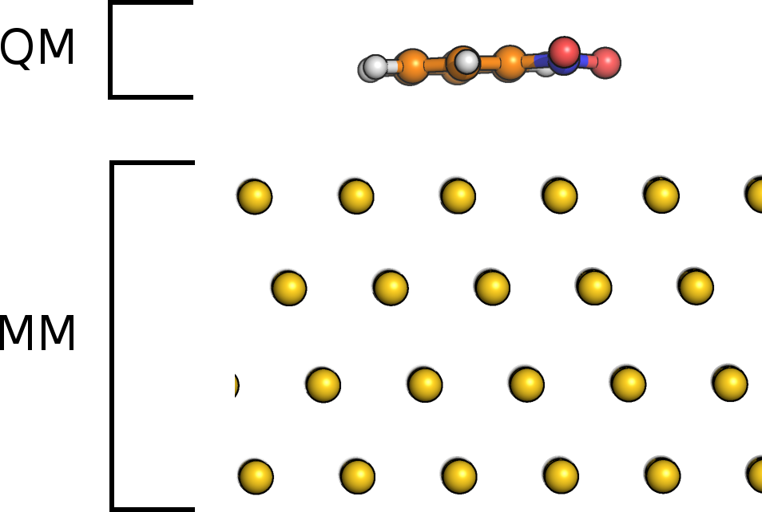

# Image charges

## Introduction

The image charge (IC) augmented QM/MM model in CP2K is designed for the simulation of
adsorbate-metal systems. The adsorbate is treated by QM whereas the metallic substrate is described
by classical force fields.

{align=center width=500px}

**Figure:** Nitrobenzene molecule on Au111. Separation in subsystems for IC-QM/MM.

The interactions between metal and adsorbate are described at the MM level of theory accounting for
the polarization of metal and adsorbate by an IC approach. The charge distribution $\rho_m$ in the
metal is modeled by a set of Gaussian charges (image charges) centered at the metal atoms,

$$
 \rho_m(\mathbf{r})= \sum_{a}{c_a g_a(\mathbf{r,R}_a)},
 \label{eq:rhom}
$$

where $\mathbf{R}_\mathrm{a}$ is the position of metal atom $a$ and $g_a$ the spherical Gaussian
function located at $a$. The expansion coefficients $c_a$ are unknown and determined in a
self-consistent procedure imposing the constant-potential condition within a metal, i.e. the sum of
$V_H(\mathbf{r})$ generated by the charge density $\rho(\mathbf{r})$ of the molecule and
$V_m(\mathbf{r})$ generated by $\rho_m$ has to be constant within the metal,

$$
 V_{H}(\mathbf{r})+V_m(\mathbf{r})=\int \frac{\rho(\mathbf{r}')+\rho_m(\mathbf{r}')}{|\mathbf{r}'-\mathbf{r}|}
 d\mathbf{r}'=V_0.
 \label{eq:const_pot}
$$

In this expression $V_0$ is a constant potential that can be different from zero, if an external
potential is applied. The implementation is embedded in the Gaussian and plane waves scheme of CP2K
and thus naturally suited for periodic systems. Details of the theory and implementation are
described in [](#Golze2013).

## Basic input

The IC method is specified in the [QMMM](#CP2K_INPUT.FORCE_EVAL.QMMM) section by

```none
&QMMM
  :
  :
  &IMAGE_CHARGE
    MM_ATOM_LIST 1..576
    EXT_POTENTIAL 0.0
  &END IMAGE_CHARGE
&END QMMM
```

The keyword [MM_ATOM_LIST](#CP2K_INPUT.FORCE_EVAL.QMMM.IMAGE_CHARGE.MM_ATOM_LIST) defines the list
of MM atoms that carrying an image charge. These are typically all metal atoms.
[EXT_POTENTIAL](#CP2K_INPUT.FORCE_EVAL.QMMM.IMAGE_CHARGE.EXT_POTENTIAL) corresponds to $V_0$ above
and is set to 0.0V by default. Note that the QM and MM box must have the same size for an IC-QM/MM
calculation.

## Print options

Detailed energy information and the normalized IC coefficients $q_a$ can be printed out by
[IMAGE_CHARGE_INFO](#CP2K_INPUT.FORCE_EVAL.QMMM.PRINT.IMAGE_CHARGE_INFO). The normalized IC
coefficients are defined as $q_a = c_a\left(\frac{\alpha}{\pi}\right)^{-\frac{3}{2}}$, where
$\alpha$ is the width of the Gaussian.

```none
&QMMM
  :
  :
  &PRINT
    &IMAGE_CHARGE_INFO
    &END
  &END PRINT
&END QMMM
```

## Advanced input options

Additional keywords that can be set in [IMAGE_CHARGE](#CP2K_INPUT.FORCE_EVAL.QMMM.IMAGE_CHARGE) are:

```none
&IMAGE_CHARGE
  MM_ATOM_LIST 1..576
  EXT_POTENTIAL 0.0
  WIDTH 3.5
  IMAGE_MATRIX_METHOD MME
  DETERM_COEFF CALC_MATRIX
  RESTART_IMAGE_MATRIX .false.
&END IMAGE_CHARGE
```

[WIDTH](#CP2K_INPUT.FORCE_EVAL.QMMM.IMAGE_CHARGE.WIDTH) refers to the width $\alpha$ of the Gaussian
$g_a$, which is the only adjustable parameter in our IC model. The energies and gradients do not
depend on $\alpha$ for values larger than 3.0 Å$^{-2}$. Small values of $\alpha$ correspond to very
broad Gaussians, which will lead to technical artifacts. Extremely large values are not recommended,
too.

[IMAGE_MATRIX_METHOD](#CP2K_INPUT.FORCE_EVAL.QMMM.IMAGE_CHARGE.IMAGE_MATRIX_METHOD) determines how
the IC matrix $T_{ab}$, Eq. 11 in [](#Golze2013), is calculated. `GPW` corresponds to the algorithm
shown in Fig. 1 in J. Chem. Theory Comput., 9, 5086 (2013), whereas `MME` is an integral scheme that
has been recently implemented and that is significantly faster.

[DETERM_COEFF](#CP2K_INPUT.FORCE_EVAL.QMMM.IMAGE_CHARGE.DETERM_COEFF) specifies how the expansion
coefficients $c_a$ are determined. With `CALC_MATRIX`, $T_{ab}$ is calculated and the linear set of
equations is solved. `ITERATIVE` avoids calculation of $T_{ab}$ in each SCF step by using an
iterative conjugate gradient scheme. The new integral scheme `MME` evaluates the matrix $T_{ab}$
very quickly, i.e. the iterative solutions is not required here, thus set always `CALC_MATRIX`.

[RESTART_IMAGE_MATRIX](#CP2K_INPUT.FORCE_EVAL.QMMM.IMAGE_CHARGE.RESTART_IMAGE_MATRIX) can be used to
restart $T_{ab}$ for an MD simulation if `ITERATIVE` is set.

```{note}
Setting these additional keywords is typically not required. The default settings are fine.
```

## Typical setup

The typical setup for an IC-QM/MM simulation is as follows

- adsorbed molecules described by DFT
- metal is constrained or described by an embedded atom model (EAM)
- Interactions between QM and MM:
  - Pauli repulsion, dispersion etc. modeled by force fields e.g. Lennard Jones
  - electrostatic interaction/induction: IC model

## Example input files

The first input example is a single guanine molecule on an Au111 surface using a modified Born-Mayer
potential to describe Pauli repulsion and dispersion between molecule and metal. The second example
is a single water molecule on Pt111. The interactions between water and metal are modeled by the
Siepmann-Sprik potential, see [](#SIEPMANN1995).

- Guanine@Au111: [Au111_guanine.tar.gz](https://www.cp2k.org/_media/howto:au111_guanine.tar.gz)
- H2O@Pt111: [Pt111_1H2O.tar.gz](https://www.cp2k.org/_media/howto:pt111_1h2o.tar.gz)
